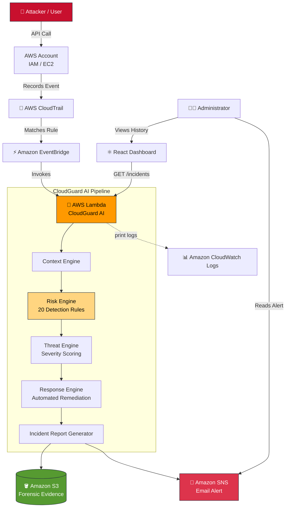
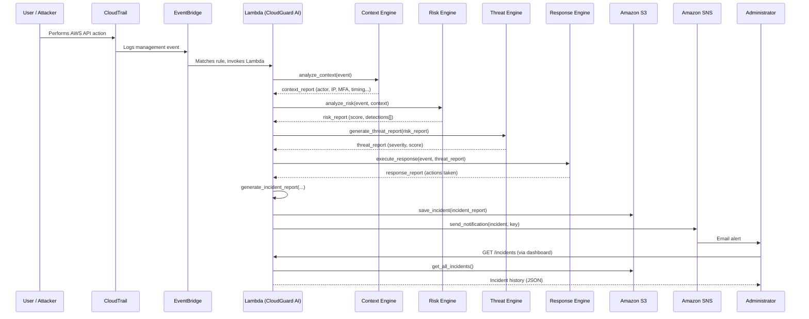
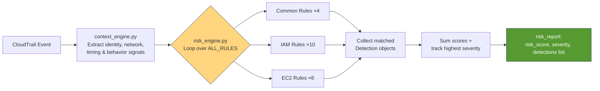
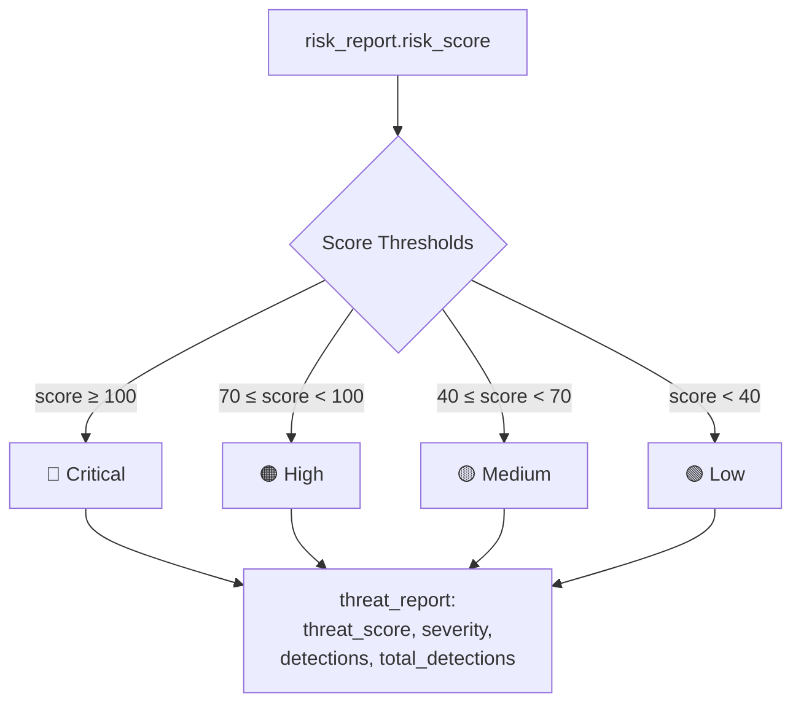
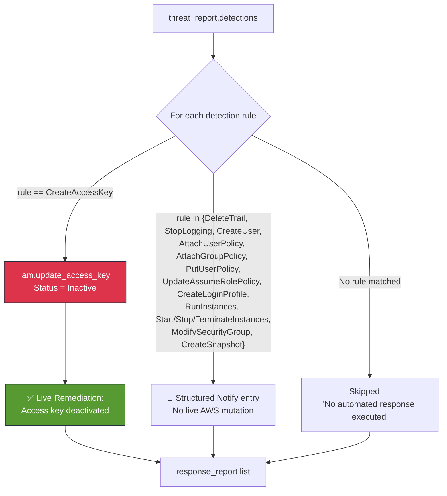
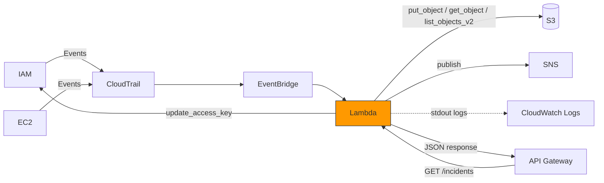
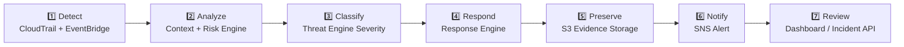
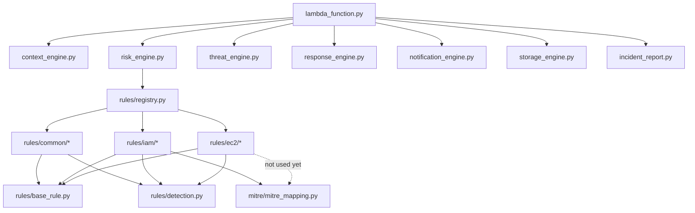

<div align="center">

# 🛡️ CloudGuard AI
### Automated Cloud Incident Detection, Response & Forensics System

**Rule-Based Serverless Threat Detection for AWS · Real-Time IAM & EC2 Monitoring · Automated Remediation · Forensic Evidence Preservation**

*Detect. Analyze. Respond. Preserve. — In Seconds, Not Hours.*

<!-- Banner Placeholder -->
<!--  -->

[](https://www.python.org/)
[](https://aws.amazon.com/lambda/)
[](https://aws.amazon.com/cloudtrail/)
[](https://aws.amazon.com/eventbridge/)
[](https://aws.amazon.com/s3/)
[](https://aws.amazon.com/sns/)
[](https://boto3.amazonaws.com/)
[](https://attack.mitre.org/)

</div>


## 📚 Table of Contents

- [Project Overview](#-project-overview)
- [Key Features](#-key-features)
- [System Architecture](#-system-architecture)
- [End-to-End Workflow](#-end-to-end-workflow)
- [Detection Engine Workflow](#-detection-engine-workflow)
- [Threat Scoring Workflow](#-threat-scoring-workflow)
- [Automated Response Workflow](#-automated-response-workflow)
- [AWS Service Interaction](#-aws-service-interaction)
- [Incident Response Lifecycle](#-incident-response-lifecycle)
- [Backend Architecture](#-backend-architecture)
- [Complete Folder Structure](#-complete-folder-structure)
- [Complete File Reference](#-complete-file-reference)
- [Backend Module Breakdown](#-backend-module-breakdown)
- [Detection Rules Catalog](#-detection-rules-catalog)
- [AWS Services Used](#-aws-services-used)
- [Technology Stack](#-technology-stack)
- [Frontend Dashboard (Demonstration Layer)](#-frontend-dashboard-demonstration-layer)
- [Suggested Visual Assets](#-suggested-visual-assets)
- [Installation & Deployment](#-installation--deployment)
- [Configuration](#-configuration)
- [Usage / Testing the Pipeline](#-usage--testing-the-pipeline)
- [Sample Attack Walkthrough](#-sample-attack-walkthrough)
- [Sample Incident Report (Real Schema)](#-sample-incident-report-real-schema)
- [Future Enhancements](#-future-enhancements)
- [Skills Demonstrated](#-skills-demonstrated)
- [Resume Bullet Points](#-resume-bullet-points)
- [Interview Preparation Questions](#-interview-preparation-questions)
- [License](#-license)
- [Contributing](#-contributing)
- [Acknowledgements](#-acknowledgements)

---

## 🎯 Project Overview

**CloudGuard AI** is a serverless, rule-based cloud security automation platform built on AWS. It continuously ingests **AWS CloudTrail** management events, evaluates them against a registry of **20 handcrafted detection rules**, computes a cumulative **risk score**, executes **automated remediation** where possible, preserves the incident as forensic evidence in **Amazon S3**, and alerts responders via **Amazon SNS** — all within a single AWS Lambda invocation, with zero standing infrastructure.

### Why this project exists

Cloud environments generate an overwhelming volume of API activity. Security teams traditionally rely on manually reviewing CloudTrail logs to catch:

- Unauthorized IAM user / access key creation
- Privilege escalation via policy or trust-relationship changes
- CloudTrail tampering (an attacker's favorite way to "go dark")
- Suspicious EC2 lifecycle activity (launch, terminate, snapshot exfiltration)
- Security Group changes that expose infrastructure

This manual process is slow, error-prone, and gives attackers a critical time window between compromise and detection. CloudGuard AI closes that window by moving detection and first-response **directly into the event path** — the moment CloudTrail records an event, EventBridge routes it to Lambda, and CloudGuard evaluates it in milliseconds.

### Relevance

| Domain | Relevance |
|---|---|
| **SOC / Blue Team** | Demonstrates detection engineering, severity triage, and alert fatigue reduction |
| **Cloud Security** | Hands-on AWS IAM, EC2, and CloudTrail hardening concepts |
| **Incident Response** | Implements the detect → analyze → respond → report lifecycle end-to-end |
| **Digital Forensics** | Every incident is preserved as an immutable, timestamped JSON artifact in S3 |
| **Security Automation** | Real automated remediation (not just alerting) for at least one attack class |

### ⚠️ Important Framing: Rule-Based, Not ML-Based

CloudGuard AI's detection engine is **deterministic and rule-based** — every rule in [`backend/rules/`](backend/rules) is a hand-authored `if/else` heuristic against CloudTrail fields, not a trained model. There is no model training, no dataset, and no inference pipeline in this repository. The "AI" in the name reflects the *automated decision-making and response orchestration*, not machine learning. Machine-learning-based anomaly detection is listed under [Future Enhancements](#-future-enhancements). Being upfront about this is intentional — it's the technically accurate answer and it holds up under scrutiny.

---

## ✨ Key Features

> Every feature below is verified against actual code in `backend/`.

<table>
<tr><td width="50%" valign="top">

#### 🔍 Real-Time CloudTrail Monitoring
CloudTrail management events flow through EventBridge directly into a single Lambda handler (`lambda_function.py`), which processes each event synchronously through the full detection pipeline.

#### 🧠 Rule-Based Detection Engine
20 independent detection rules (`backend/rules/`) evaluate every event. Each rule is a self-contained class implementing `evaluate(event, context)` and returning a structured `Detection` object.

#### 📊 Cumulative Risk Scoring
`risk_engine.py` runs **every** registered rule against every event (not just the first match) and sums all matched scores — meaning a single event can trigger multiple rules simultaneously (e.g. "CreateUser" + "No MFA" + "After Hours").

#### 🎯 Severity Classification
`threat_engine.py` converts the cumulative score into a four-tier severity band: **Low → Medium → High → Critical**, using fixed score thresholds.

#### 🗺️ MITRE ATT&CK Mapping
`mitre/mitre_mapping.py` maps 15 CloudTrail event names to their corresponding MITRE ATT&CK technique ID, technique name, and tactic(s) — giving every detection a recognized industry framework reference.

</td><td width="50%" valign="top">

#### ⚡ Automated Response Engine
`response_engine.py` performs **live IAM remediation**: it programmatically deactivates any IAM access key flagged by the `CreateAccessKey` rule using `iam.update_access_key(..., Status="Inactive")`. All other triggered rules generate a structured "Notify" response entry (see [Response Engine](#3-response-engine-responseenginepy) for exact scope).

#### 📩 SNS Email Notifications
`notification_engine.py` builds a fully formatted, human-readable incident summary (severity, actor, network context, all triggered rules, all response actions) and publishes it to an SNS topic.

#### 🗄️ S3 Forensic Evidence Storage
`storage_engine.py` persists every incident as a JSON object under `incidents/{incident_id}.json` in S3, and exposes `get_incident()` / `get_all_incidents()` for retrieval by the API layer.

#### 📄 Structured Incident Reports
`reports/incident_report.py` assembles a single, consistent incident JSON schema (event, actor, network, context, risk, threat, response) for every processed event.

#### 🌐 Built-In REST API (API Gateway + Lambda)
The **same** Lambda function also serves `GET /incidents` and `GET /incidents/{id}` routes (routed via `event["requestContext"]["routeKey"]`), which the dashboard consumes to render historical incidents.

#### 🧩 Context-Aware Behavioral Rules
Beyond simple event-name matching, `context_engine.py` derives behavioral signals — MFA usage, cross-user actions, after-hours activity, and suspicious CLI/SDK user agents — that feed four independent "Common" detection rules.

</td></tr>
</table>

---

## 🏗️ System Architecture



---

## 🔄 End-to-End Workflow



---

## 🧪 Detection Engine Workflow



Each rule is fully independent and stateless — a single event is evaluated against **all 20 rules every time**, so multiple rules can legitimately fire on one event (this is intentional and is what produces realistic layered risk scores).

---

## 📈 Threat Scoring Workflow



> **Note:** `threat_engine.py` derives severity purely from the *cumulative numeric score*, independently re-deriving it rather than reusing `risk_engine`'s own `highest_severity` field. This is a deliberate two-stage scoring design worth calling out in interviews (see [Interview Questions](#-interview-preparation-questions)).

---

## 🤖 Automated Response Workflow



**Honest scope:** Today, CloudGuard AI performs **one** class of *active* remediation — automatically deactivating IAM access keys created via `CreateAccessKey`. Every other rule produces a well-structured, audit-ready "Notify" action rather than a live infrastructure change (e.g., it does **not** currently disable IAM users, detach policies, quarantine EC2 instances, or revoke security group rules — see [Future Enhancements](#-future-enhancements)). This scoped, verifiable automation is safer than broad auto-remediation and is a defensible design choice to discuss in interviews.

---

## 🔗 AWS Service Interaction



| From | To | Mechanism | Purpose |
|---|---|---|---|
| IAM / EC2 | CloudTrail | Native AWS event logging | Capture every management API call |
| CloudTrail | EventBridge | Event rule pattern match | Route only relevant events to Lambda |
| EventBridge | Lambda | Target invocation | Trigger CloudGuard AI's pipeline |
| Lambda | IAM | `boto3.client("iam").update_access_key()` | Live remediation for compromised access keys |
| Lambda | S3 | `boto3.client("s3")` — `put_object`, `get_object`, `list_objects_v2` | Store and retrieve incident JSON reports |
| Lambda | SNS | `boto3.client("sns").publish()` | Deliver formatted alert emails |
| Lambda | CloudWatch Logs | Implicit via Lambda runtime `print()` | Execution tracing / debugging (no dedicated logging module) |
| API Gateway | Lambda | `requestContext.routeKey` branching | Serve dashboard's incident history API |

---

## 🚨 Incident Response Lifecycle



---

## 🏛️ Backend Architecture

The backend is a single **Python 3 AWS Lambda function** (`backend/lambda_function.py`) organized as a modular pipeline rather than a monolith. It follows a clean separation of concerns:

```
Event → Context Extraction → Rule Evaluation → Scoring → Response → Reporting → Persistence → Notification
```

<details>
<summary><strong>📦 Package Responsibilities</strong> (click to expand)</summary>

| Package | Responsibility |
|---|---|
| `engines/` | The core processing pipeline — context extraction, risk scoring, threat classification, automated response, notification, and S3 persistence |
| `rules/` | The detection rule registry — one class per detectable CloudTrail event/behavior, grouped by `common/`, `iam/`, `ec2/`, and a currently-empty `network/` package reserved for future rules |
| `mitre/` | Static lookup table mapping CloudTrail event names to MITRE ATT&CK techniques and tactics |
| `reports/` | Assembles the final, S3-persisted incident JSON document from all pipeline outputs |

</details>

<details>
<summary><strong>🔁 Function Call Sequence</strong> (click to expand)</summary>

```
lambda_handler(event, context)
 ├─ if API Gateway request → get_all_incidents() / get_incident(id)  [returns early]
 └─ else (CloudTrail/EventBridge event):
     ├─ analyze_context(event)                     → context_report
     ├─ analyze_risk(event, context_report)         → risk_report
     │    └─ for rule in ALL_RULES: rule.evaluate(event, context)
     ├─ generate_threat_report(risk_report)         → threat_report
     ├─ execute_response(event, threat_report)      → response_report
     │    └─ if rule == "CreateAccessKey": iam.update_access_key(...)
     ├─ generate_incident_report(context, risk, threat, response) → incident_report
     ├─ save_incident(incident_report)              → S3 key
     └─ send_notification(incident_report, key)     → SNS publish
```

</details>

<details>
<summary><strong>🗂️ Dependency Graph</strong> (click to expand)</summary>



> `engines/evidence_engine.py` (`build_evidence()`) exists in the codebase but is **not currently imported or called** by `lambda_function.py` or any other module — it is scaffolded but not wired into the live pipeline. Documented here for accuracy rather than omitted.

</details>

---

## 📁 Complete Folder Structure

```
CloudGuard-AI-Automated-Cloud-Incident-Detection-Response-System/
│
├── backend/                             # 🧠 Core security engine (98% of this project)
│   ├── lambda_function.py               # Single entry point — CloudTrail events + REST API routes
│   ├── requirements.txt                 # Python dependencies (boto3 ships with Lambda runtime)
│   ├── cloudguard-ai.zip                # Pre-built Lambda deployment package
│   │
│   ├── engines/                         # Core processing pipeline
│   │   ├── context_engine.py            # Extracts identity, network, timing & behavior context
│   │   ├── risk_engine.py               # Runs all detection rules, aggregates score
│   │   ├── threat_engine.py             # Converts score → severity classification
│   │   ├── response_engine.py           # Executes automated remediation actions
│   │   ├── notification_engine.py       # Formats & sends SNS email alerts
│   │   ├── storage_engine.py            # Persists/retrieves incidents in S3
│   │   └── evidence_engine.py           # Evidence builder (not yet wired into pipeline)
│   │
│   ├── rules/                           # Detection rule registry
│   │   ├── base_rule.py                 # Abstract base class for all rules
│   │   ├── detection.py                 # Detection result data object
│   │   ├── registry.py                  # ALL_RULES — the full active rule set
│   │   ├── common/                      # Behavioral rules (MFA, cross-user, after-hours, UA)
│   │   ├── iam/                         # IAM-specific detection rules (10 rules)
│   │   ├── ec2/                         # EC2-specific detection rules (6 rules + 2 empty stubs)
│   │   └── network/                     # Reserved package — currently empty (no rules yet)
│   │
│   ├── mitre/
│   │   └── mitre_mapping.py             # CloudTrail event → MITRE ATT&CK technique lookup
│   │
│   └── reports/
│       └── incident_report.py           # Assembles final incident JSON schema
│
├── dashboard/                           # ⚛️ React demonstration UI (2% of this project)
│   ├── src/
│   │   ├── pages/                       # Dashboard, Incidents, Analytics, AWS Resources, Settings
│   │   ├── components/                  # Navbar, Sidebar, IncidentTable, SummaryCard
│   │   ├── services/api.js              # Axios client calling the Lambda /incidents API
│   │   ├── data/                        # Static mock data used by the Dashboard landing page
│   │   └── layouts/MainLayout.jsx       # Shell layout (Navbar + Sidebar + routed content)
│   └── package.json                     # React 19 + Vite + Recharts + Axios
│
├── .gitignore
└── README.md
```

---

## 📋 Complete File Reference

<details>
<summary><strong>Backend — Engines</strong> (click to expand)</summary>

| File | Purpose | Key Function(s) | AWS Services |
|---|---|---|---|
| `lambda_function.py` | Single Lambda entry point; routes API Gateway vs. CloudTrail events | `lambda_handler()` | Lambda, SNS, S3 (clients init) |
| `engines/context_engine.py` | Extracts actor, network, timing, and behavioral signals from a raw event | `analyze_context()` | — |
| `engines/risk_engine.py` | Iterates every rule in `ALL_RULES`, aggregates matched detections and score | `analyze_risk()` | — |
| `engines/threat_engine.py` | Maps cumulative score to severity band | `generate_threat_report()` | — |
| `engines/response_engine.py` | Executes automated remediation / structured notify actions | `execute_response()` | IAM |
| `engines/notification_engine.py` | Builds and publishes the formatted SNS alert | `send_notification()` | SNS |
| `engines/storage_engine.py` | Saves/retrieves incident JSON in S3 | `save_incident()`, `get_incident()`, `get_all_incidents()` | S3 |
| `engines/evidence_engine.py` | Builds an evidence list from MITRE + context data (unused currently) | `build_evidence()` | — |

</details>

<details>
<summary><strong>Backend — Rules, MITRE, Reports</strong> (click to expand)</summary>

| File | Purpose | AWS Services |
|---|---|---|
| `rules/base_rule.py` | Abstract base class — enforces every rule implements `evaluate()` | — |
| `rules/detection.py` | Standard `Detection` result object (`matched`, `rule`, `severity`, `score`, `reason`, `recommendation`, `mitre`) | — |
| `rules/registry.py` | Defines `ALL_RULES` — the authoritative list of active detection rule instances | — |
| `rules/common/*.py` | 4 behavioral rules: MFA, Cross-User, After-Hours, Suspicious User Agent | — |
| `rules/iam/*.py` | 10 IAM event rules (see [Detection Rules Catalog](#-detection-rules-catalog)) | — |
| `rules/ec2/*.py` | 6 active EC2 rules + `security_group_rule.py` and `snapshot_rule.py`, which are empty placeholder files superseded by `modify_security_group_rule.py` / `create_snapshot_rule.py` | — |
| `rules/network/__init__.py` | Empty package reserved for future network-layer rules | — |
| `mitre/mitre_mapping.py` | Static dict mapping 15 event names to MITRE technique ID/name/tactics | — |
| `reports/incident_report.py` | Assembles the final incident schema from context/risk/threat/response | — |

</details>

<details>
<summary><strong>Frontend — Dashboard (summary only, per project scope)</strong> (click to expand)</summary>

| File | Purpose |
|---|---|
| `src/App.jsx` | Route definitions for Dashboard, Incidents, Analytics, AWS Resources, Settings, Incident Details |
| `src/services/api.js` | Axios client — `getIncidents()`, `getIncident(id)` calling the Lambda REST API |
| `src/pages/Analytics.jsx` | Fetches live incidents via `getIncidents()` |
| `src/pages/IncidentDetails.jsx` | Fetches a single incident via `getIncident()` |
| `src/pages/Dashboard.jsx` | Renders summary cards using **static local mock data** (`data/summaryData.js`, `data/incidentsData.js`), not the live API |
| `src/components/*` | Presentational components (Navbar, Sidebar, IncidentTable, SummaryCard) |

</details>

---

## 🧩 Backend Module Breakdown

### 1. Context Engine (`context_engine.py`)
Parses the raw CloudTrail `detail` block and derives a normalized context object: `actor`, `target_user`, `user_type`, `account_id`, `event_name`, `event_source`, `event_time`/`event_hour`, `source_ip`, `aws_region`, `user_agent`, `is_suspicious_user_agent` (flags `curl`, `python`, `powershell`, `botocore`, `aws-cli` substrings), `mfa_used`, `is_cross_user_action`, and `is_after_hours` (outside 08:00–18:00 UTC).

### 2. Risk Engine (`risk_engine.py`)
Runs **all 20 rules** from `rules/registry.py` against every event, wrapping each call in a `try/except` so one failing rule cannot break the pipeline. Sums the score of every matched rule and tracks the single highest severity seen.

### 3. Threat Engine (`threat_engine.py`)
Takes the risk engine's cumulative score and independently classifies it into `Low` / `Medium` / `High` / `Critical` using fixed thresholds (`≥100`, `≥70`, `≥40`, else Low).

### 4. Response Engine (`response_engine.py`)
For each matched detection, dispatches on `rule` name:
- **`CreateAccessKey`** → live remediation: extracts `userName`/`accessKeyId` from the CloudTrail `responseElements` and calls `iam.update_access_key(Status="Inactive")`.
- **13 other rule names** (`DeleteTrail`, `StopLogging`, `CreateUser`, `AttachUserPolicy`, `AttachGroupPolicy`, `PutUserPolicy`, `UpdateAssumeRolePolicy`, `CreateLoginProfile`, `RunInstances`, `StartInstances`, `StopInstances`, `TerminateInstances`, `ModifySecurityGroup`, `CreateSnapshot`) → structured `"Notify"` action, no live AWS mutation.
- No detections at all → single `"Skipped"` response entry.

### 5. Notification Engine (`notification_engine.py`)
Builds a plain-text formatted alert (severity, score, event, actor, network, every triggered rule with its reason, every response action, and the S3 evidence key) and publishes it via `sns.publish()` with a subject line of `[CloudGuard] {severity} - {event_name}`.

### 6. Storage / Forensics (`storage_engine.py`)
Every incident is written to `s3://{S3_BUCKET}/incidents/{incident_id}.json`. `get_all_incidents()` lists and fetches every object under the `incidents/` prefix for the dashboard's history views — this **is** the project's forensic evidence preservation mechanism.

### 7. Incident Report Generator (`reports/incident_report.py`)
Assembles the single canonical incident document: `incident_id` (UUID), `generated_at` (UTC ISO timestamp), `event`, `actor`, `network`, `context`, `risk`, `threat`, and `response` blocks — this exact structure is both what's stored in S3 and what's returned by the REST API.

### 8. Logging
There is no dedicated logging module. Execution visibility comes from the Lambda runtime's implicit capture of `print()` statements (raw event, context/risk/threat/response/incident report snapshots) into **Amazon CloudWatch Logs**.

---

## 🎯 Detection Rules Catalog

<details>
<summary><strong>Common / Behavioral Rules (4)</strong></summary>

| Rule Class | Trigger Condition | Base Severity | Score | MITRE |
|---|---|---|---|---|
| `MFARule` | `mfa_used == False` on the request | Medium | 20 | T1078 |
| `CrossUserRule` | Actor ≠ target IAM user | High | 30 | T1098 |
| `AfterHoursRule` | Event hour outside 08:00–18:00 UTC | Medium | 15 | T1078 |
| `UserAgentRule` | User agent contains `curl`/`python`/`powershell`/`botocore`/`aws-cli` | Medium | 20 | T1078 |

</details>

<details>
<summary><strong>IAM Rules (10)</strong></summary>

| Rule Class | CloudTrail Event | Base Severity | Score | Escalation Logic | MITRE |
|---|---|---|---|---|---|
| `RootUserRule` | Any event where `userIdentity.type == "Root"` | Critical | 40 | — | T1078 |
| `CreateUserRule` | `CreateUser` | Medium | 25 | — | T1136 |
| `CreateAccessKeyRule` | `CreateAccessKey` | High | 30 | — | T1098 |
| `CreateLoginProfileRule` | `CreateLoginProfile` | High | 30 | — | T1098 |
| `AttachUserPolicyRule` | `AttachUserPolicy` | High | 35 | → **Critical / 50** if policy ARN contains `AdministratorAccess` | T1098 |
| `AttachGroupPolicyRule` | `AttachGroupPolicy` | High | 35 | → **Critical / 50** if policy ARN contains `AdministratorAccess` | T1098 |
| `PutUserPolicyRule` | `PutUserPolicy` | High | 35 | → **Critical / 50** if inline policy document contains `*` or `AdministratorAccess` | T1098 |
| `UpdateAssumeRolePolicyRule` | `UpdateAssumeRolePolicy` | Critical | 50 | → **60** if trust policy contains `:root` or `*` (cross-account risk) | T1484 |
| `DeleteTrailRule` | `DeleteTrail` | Critical | 60 | — | T1562 |
| `StopLoggingRule` | `StopLogging` | Critical | 60 | — | T1562 |

</details>

<details>
<summary><strong>EC2 Rules (6 active)</strong></summary>

| Rule Class | CloudTrail Event(s) | Severity | Score | MITRE |
|---|---|---|---|---|
| `RunInstancesRule` | `RunInstances` | Medium | 25 | T1583.002 |
| `StartInstancesRule` | `StartInstances` | Low | 15 | T1583.002 |
| `StopInstancesRule` | `StopInstances` | Medium | 25 | T1489 |
| `TerminateInstancesRule` | `TerminateInstances` | High | 40 | T1485 |
| `ModifySecurityGroupRule` | `AuthorizeSecurityGroupIngress/Egress`, `RevokeSecurityGroupIngress/Egress` | High | 35 | T1562 |
| `CreateSnapshotRule` | `CreateSnapshot` | Medium | 30 | T1005 |

📎 `rules/ec2/security_group_rule.py` and `rules/ec2/snapshot_rule.py` are **empty placeholder files** in the current codebase, superseded by the two rules above, and are not part of `ALL_RULES`.

</details>

> **Not yet implemented** (present in project documentation as intended scope, not in code): `DeleteUser`, `DeleteAccessKey`, `DetachUserPolicy`, `DetachGroupPolicy`, `DeletePolicy`, `CreateRole`, `DeleteRole`, `Console Login Failure`, `RebootInstances`, `DeleteSnapshot`, IAM Policy modification beyond `PutUserPolicy`. See [Future Enhancements](#-future-enhancements).

---

## ☁️ AWS Services Used

| Service | Purpose | How CloudGuard Uses It |
|---|---|---|
| **AWS CloudTrail** | Management event logging | Source of truth for every API action across the account |
| **Amazon EventBridge** | Event routing | Filters CloudTrail events and invokes Lambda on rule match |
| **AWS Lambda** | Serverless compute | Hosts the entire CloudGuard AI pipeline and the REST API |
| **Amazon S3** | Object storage | Stores every incident report as JSON for forensic evidence and dashboard retrieval |
| **Amazon SNS** | Pub/Sub messaging | Delivers real-time formatted email alerts to responders |
| **Amazon CloudWatch Logs** | Log aggregation | Implicit capture of Lambda `print()` execution traces |
| **AWS IAM** | Identity & access management | Both the monitored surface (rules) and the remediation target (`update_access_key`) |
| **Amazon API Gateway** *(implied by `requestContext.routeKey` handling)* | HTTP API front door | Exposes `GET /incidents` and `GET /incidents/{id}` to the dashboard |

---

## 🛠️ Technology Stack

**Language**


**AWS SDK**


**AWS Services**
`Lambda` · `CloudTrail` · `EventBridge` · `S3` · `SNS` · `CloudWatch Logs` · `IAM` · `API Gateway`

**Security Concepts**
`Incident Response` · `Digital Forensics` · `Cloud Monitoring` · `IAM Security` · `Automated Remediation` · `Evidence Preservation` · `MITRE ATT&CK Mapping` · `Severity Scoring`

**Frontend (demonstration layer only)**


`react-router-dom` · `axios` · `recharts` · `lucide-react`

---

## 💻 Frontend Dashboard (Demonstration Layer)

The frontend is a lightweight React (Vite) interface developed solely for demonstrating CloudGuard AI's backend security workflows. It provides a simple visualization layer — a dashboard, incident list, incident detail view, analytics charts, and an AWS resources page — for the incidents produced by the backend, consumed via the `GET /incidents` and `GET /incidents/{id}` routes exposed by the same Lambda function. The primary focus of this project is, and remains, the AWS-powered backend security automation system; the dashboard's Analytics and Incident Details pages call the live API, while the landing Dashboard page currently renders illustrative static mock data (`src/data/`).

---

## 🚀 Installation & Deployment

### Prerequisites
- Python 3.x
- Node.js 18+ (for the dashboard)
- An AWS account with permissions to configure CloudTrail, EventBridge, Lambda, S3, SNS, IAM, and CloudWatch
- AWS CLI configured (`aws configure`)

### 1. Clone the repository
```bash
git clone https://github.com/Priyam7302/CloudGuard-AI-Automated-Cloud-Incident-Detection-Response-System.git
cd CloudGuard-AI-Automated-Cloud-Incident-Detection-Response-System
```

### 2. Backend — Lambda deployment
```bash
cd backend

# The repo already ships a pre-built deployment package:
# backend/cloudguard-ai.zip

# To rebuild it from source instead:
zip -r cloudguard-ai.zip engines/ rules/ mitre/ reports/ lambda_function.py

aws lambda create-function \
  --function-name cloudguard-ai \
  --runtime python3.12 \
  --role arn:aws:iam::<ACCOUNT_ID>:role/<CLOUDGUARD_EXECUTION_ROLE> \
  --handler lambda_function.lambda_handler \
  --zip-file fileb://cloudguard-ai.zip \
  --environment "Variables={S3_BUCKET=<your-bucket>,SNS_TOPIC_ARN=<your-topic-arn>}"
```

### 3. Required IAM permissions (Lambda execution role)
The execution role needs, at minimum:
- `s3:PutObject`, `s3:GetObject`, `s3:ListBucket` on the evidence bucket
- `sns:Publish` on the alert topic
- `iam:UpdateAccessKey` (required for the live `CreateAccessKey` remediation)
- `logs:CreateLogGroup`, `logs:CreateLogStream`, `logs:PutLogEvents`

### 4. CloudTrail setup
- Enable an organization or account-level trail with **management events** logging enabled (Read + Write).

### 5. EventBridge rule
Create a rule matching CloudTrail-sourced events for the monitored IAM and EC2 API calls, with the Lambda function as the target. Example event pattern:
```json
{
  "source": ["aws.iam", "aws.ec2"],
  "detail-type": ["AWS API Call via CloudTrail"]
}
```

### 6. SNS setup
```bash
aws sns create-topic --name cloudguard-alerts
aws sns subscribe --topic-arn <topic-arn> --protocol email --notification-endpoint you@example.com
```

### 7. S3 setup
```bash
aws s3 mb s3://<your-evidence-bucket>
```

### 8. API Gateway (for the dashboard's incident history)
Create an HTTP API with routes `GET /incidents` and `GET /incidents/{id}`, both integrated with the CloudGuard Lambda function.

### 9. Frontend dashboard
```bash
cd dashboard
npm install
echo "VITE_API_URL=<your-api-gateway-invoke-url>" > .env
npm run dev
```

---

## ⚙️ Configuration

| Environment Variable | Used By | Purpose |
|---|---|---|
| `S3_BUCKET` | `lambda_function.py`, `storage_engine.py` | Target bucket for incident JSON storage |
| `SNS_TOPIC_ARN` | `lambda_function.py`, `notification_engine.py` | Topic ARN for alert delivery |
| `VITE_API_URL` | `dashboard/src/services/api.js` | Base URL for the Lambda-backed incidents API (frontend `.env`) |

`backend/requirements.txt` is intentionally empty — `boto3` and `botocore` are already provided by the AWS Lambda Python runtime and do not need to be packaged.

---

## 🧪 Usage / Testing the Pipeline

Simulate these AWS CLI calls (with a test IAM principal, in a non-production account) to exercise the detection rules end-to-end:

```bash
# Triggers CreateUserRule (+ possibly CrossUserRule, MFARule, AfterHoursRule)
aws iam create-user --user-name cloudguard-test-user

# Triggers CreateAccessKeyRule AND live remediation (key is auto-deactivated)
aws iam create-access-key --user-name cloudguard-test-user

# Triggers AttachUserPolicyRule — escalates to Critical if AdministratorAccess
aws iam attach-user-policy \
  --user-name cloudguard-test-user \
  --policy-arn arn:aws:iam::aws:policy/AdministratorAccess

# Triggers RunInstancesRule
aws ec2 run-instances --image-id ami-xxxxxxxx --instance-type t2.micro --count 1

# Triggers TerminateInstancesRule
aws ec2 terminate-instances --instance-ids i-xxxxxxxxxxxxxxxxx

# Triggers ModifySecurityGroupRule
aws ec2 authorize-security-group-ingress \
  --group-id sg-xxxxxxxx --protocol tcp --port 22 --cidr 0.0.0.0/0
```

After each call, check:
1. **CloudWatch Logs** for the Lambda function — full pipeline trace
2. **S3** `incidents/` prefix — the newly created incident JSON
3. **Your inbox** — the SNS alert email
4. **The dashboard** — `Incidents` and `Analytics` pages (live API-backed)

---

## 🕵️ Sample Attack Walkthrough

**Scenario:** An attacker with compromised credentials creates a new IAM access key outside business hours, without MFA, for a different user than themselves.

1. Attacker runs `aws iam create-access-key --user-name victim-user` at 02:14 UTC.
2. **CloudTrail** records the `CreateAccessKey` event with `responseElements.accessKey`.
3. **EventBridge** matches the IAM event pattern and invokes CloudGuard AI's Lambda.
4. **Context Engine** derives: `actor = attacker-session`, `target_user = victim-user`, `is_cross_user_action = true`, `mfa_used = false`, `is_after_hours = true` (02:00 UTC).
5. **Risk Engine** evaluates all 20 rules. Matches:
   - `CreateAccessKeyRule` → High, 30
   - `CrossUserRule` → High, 30
   - `MFARule` → Medium, 20
   - `AfterHoursRule` → Medium, 15
   - Cumulative score: **95**
6. **Threat Engine** classifies score 95 as **High** severity (below the 100-point Critical threshold).
7. **Response Engine** matches `CreateAccessKey` → extracts `accessKeyId` from `responseElements` → calls `iam.update_access_key(Status="Inactive")` → the key is deactivated **before the attacker can use it**.
8. **Incident Report** is assembled with all four detections, the response action, and full context.
9. **Storage Engine** writes `incidents/{uuid}.json` to S3.
10. **Notification Engine** emails the security team a formatted High-severity alert within seconds of the original API call.
11. Administrator reviews the incident on the dashboard's **Incident Details** page, referencing the MITRE ATT&CK technique (`T1098 — Account Manipulation`) attached to the `CreateAccessKey` rule.

---

## 📄 Sample Incident Report (Real Schema)

This matches the exact structure produced by `reports/incident_report.py` and stored in S3:

```json
{
  "incident_id": "8f14e45f-ceea-4e63-9a1f-2b3c4d5e6f70",
  "generated_at": "2026-08-05T02:14:07.512841+00:00",
  "event": {
    "event_name": "CreateAccessKey",
    "event_source": "iam.amazonaws.com",
    "event_time": "2026-08-05T02:14:05Z"
  },
  "actor": {
    "user": "attacker-session",
    "target_user": "victim-user",
    "user_type": "AssumedRole",
    "account_id": "123456789012"
  },
  "network": {
    "source_ip": "203.0.113.42",
    "aws_region": "us-east-1",
    "user_agent": "aws-cli/2.15.0 botocore/1.31.0"
  },
  "context": {
    "mfa_used": false,
    "after_hours": true,
    "cross_user_action": true
  },
  "risk": {
    "risk_score": 95,
    "severity": "High",
    "detections": [
      {
        "matched": true,
        "rule": "CreateAccessKey",
        "category": "IAM",
        "severity": "High",
        "score": 30,
        "reason": "New Access Key created for IAM user 'victim-user'.",
        "recommendation": "Verify that the access key creation was authorized.",
        "mitre": { "technique_id": "T1098", "technique_name": "Account Manipulation", "tactics": ["Persistence"] }
      },
      {
        "matched": true,
        "rule": "Cross User Operation",
        "category": "Common",
        "severity": "High",
        "score": 30,
        "reason": "IAM user 'attacker-session' performed an operation on IAM user 'victim-user'.",
        "recommendation": "Verify whether the actor is authorized to modify another IAM identity.",
        "mitre": "T1098"
      }
    ]
  },
  "threat": {
    "threat_score": 95,
    "severity": "High",
    "detections": ["... same detections array ..."],
    "total_detections": 4
  },
  "response": [
    {
      "rule": "CreateAccessKey",
      "action": "DeactivateAccessKey",
      "status": "Success",
      "message": "Access Key AKIAxxxxxxxxxxxxx disabled."
    }
  ]
}
```

---

## 🔮 Future Enhancements

> Explicitly labeled per the project's actual current scope — **none of these exist in the codebase today.**

- 🔮 **Machine Learning-based anomaly detection** to complement the current rule-based engine (mentioned as the project's own stated roadmap)
- 🔮 **Threat intelligence feed integration** (e.g., IP reputation, known malicious ASNs)
- 🔮 **SIEM integration** (Splunk, Elastic, Sentinel)
- 🔮 **AWS GuardDuty & Security Hub integration** for correlated findings
- 🔮 **Slack / Microsoft Teams notification channels** (currently SNS/email only)
- 🔮 **Full MITRE ATT&CK Navigator-style visualization**
- 🔮 **Expanded automated remediation**: disable IAM users, detach/delete policies, quarantine EC2 instances (isolate security groups), auto-revoke overly permissive security group rules
- 🔮 **Additional detection rules**: `DeleteUser`, `DeleteAccessKey`, `DetachUserPolicy`, `DetachGroupPolicy`, `DeletePolicy`, `CreateRole`, `DeleteRole`, console login failures, `RebootInstances`, `DeleteSnapshot`
- 🔮 **Network-layer detection rules** (the `rules/network/` package is currently an empty placeholder)
- 🔮 **Risk scoring dashboard / analytics** beyond the current Recharts-based Analytics page
- 🔮 **Wiring `evidence_engine.py` into the live pipeline** (currently implemented but unused)

---

## 🧠 Skills Demonstrated

`AWS Cloud Security` · `Incident Response` · `Digital Forensics` · `Security Automation` · `Serverless Computing (Lambda)` · `Event-Driven Architecture (EventBridge)` · `Python (boto3)` · `IAM Security Engineering` · `Threat Detection Rule Authoring` · `MITRE ATT&CK Framework Mapping` · `Cloud Monitoring (CloudTrail/CloudWatch)` · `REST API Design` · `SOC Workflow Design`

---

## 📝 Resume Bullet Points

1. Designed and built a serverless AWS security automation platform (Lambda, CloudTrail, EventBridge) that reduces Mean Time to Detect for cloud-based attacks.
2. Engineered a modular, rule-based detection engine comprising 20 independent detection rules across IAM, EC2, and behavioral (MFA/cross-user/after-hours) categories.
3. Implemented cumulative multi-rule risk scoring with four-tier severity classification (Low/Medium/High/Critical) using threshold-based logic in Python.
4. Mapped 15+ AWS CloudTrail event types to MITRE ATT&CK techniques and tactics, enabling standardized threat classification.
5. Built an automated remediation workflow that programmatically deactivates compromised IAM access keys via boto3 within the incident's Lambda execution.
6. Designed a forensic evidence pipeline that persists structured, timestamped incident reports to Amazon S3 for audit and investigation.
7. Integrated Amazon SNS to deliver real-time, human-readable security alerts summarizing severity, actor, network context, and response actions.
8. Extended a single AWS Lambda function to serve a dual purpose: CloudTrail event processor and REST API backend (via API Gateway) for a React dashboard.
9. Developed a React (Vite) security operations dashboard consuming a custom incident API, including incident list, detail, and analytics views.
10. Practiced transparent security engineering documentation by explicitly distinguishing implemented capabilities from planned/future features (e.g., rule-based vs. ML-based detection).

---

## 🎤 Interview Preparation Questions

<details>
<summary><strong>25 questions based strictly on the implemented backend</strong> (click to expand)</summary>

1. Walk me through what happens, function by function, from the moment CloudTrail records a `CreateAccessKey` event to the SNS email being sent.
2. Why does `risk_engine.py` evaluate *every* rule instead of stopping at the first match — what design goal does that serve?
3. `threat_engine.py` re-derives severity from the numeric score instead of reusing `risk_engine`'s `highest_severity` value — why might a two-stage scoring design be intentional?
4. Walk through how `response_engine.py` extracts the access key ID and user name from the CloudTrail event to call `iam.update_access_key()`.
5. Why is `CreateAccessKey` the only rule with live automated remediation, while 13 other rules only produce a "Notify" action?
6. What risk would you weigh before expanding auto-remediation to disabling IAM users or quarantining EC2 instances?
7. How does `context_engine.py` determine whether MFA was used, and what CloudTrail field does it read?
8. Explain the `is_suspicious_user_agent` heuristic — what are its false-positive risks (e.g., legitimate use of the AWS CLI)?
9. How is "after hours" defined in this system, and what's a limitation of a fixed UTC business-hours window?
10. Why does `CrossUserRule` matter for detecting privilege escalation, and what's an example of a benign cross-user action it might falsely flag?
11. How does `AttachUserPolicyRule` distinguish a routine policy attachment from a critical one?
12. Walk through the escalation logic in `PutUserPolicyRule` — what string patterns trigger the Critical severity bump?
13. Why are `StopLogging` and `DeleteTrail` both scored as Critical (60) — what's the underlying attacker motivation (MITRE T1562)?
14. What is MITRE ATT&CK, and how does `mitre_mapping.py` connect a CloudTrail event name to a technique and tactic?
15. What would you need to change to support an event whose MITRE mapping isn't in `MITRE_MAPPING` — trace through `get_mitre_mapping()`'s fallback.
16. Why is `evidence_engine.py` present in the codebase but never called — how would you go about safely integrating it?
17. What's stored under `incidents/{incident_id}.json` in S3, and why is that a defensible forensic evidence design?
18. How does the same Lambda function differentiate a CloudTrail/EventBridge invocation from an API Gateway invocation?
19. What would happen if two CloudTrail events for the same incident arrived concurrently — is there any idempotency protection today?
20. Why might storing every incident as an individual S3 object (versus a database) be a reasonable MVP choice, and what are its scaling limits?
21. `rules/registry.py` hardcodes `ALL_RULES` as a Python list — what tradeoffs exist versus a dynamic rule-loading mechanism?
22. What's the purpose of the `try/except` around each rule's `evaluate()` call inside `risk_engine.py`?
23. Explain why the project explicitly avoids calling itself a machine-learning system, and what would be needed to add real ML-based anomaly detection.
24. `rules/ec2/security_group_rule.py` and `snapshot_rule.py` are empty — what does that tell you about how this codebase evolved, and how would you clean it up before a production release?
25. If you had to add a new detection rule for `DeleteUser` today, walk through every file you'd touch, from the rule class to the registry to (optionally) response and MITRE mapping.

</details>

---

## 📜 License

This project is available under the **MIT License**. See the [LICENSE](LICENSE) file for details.
*(No `LICENSE` file currently exists in the repository — add one to make this section accurate, or update it to reflect your chosen license.)*

---

## 🤝 Contributing

Contributions, issues, and feature requests are welcome!

1. Fork the repository
2. Create a feature branch (`git checkout -b feature/new-detection-rule`)
3. Commit your changes (`git commit -m "Add DeleteUser detection rule"`)
4. Push to the branch (`git push origin feature/new-detection-rule`)
5. Open a Pull Request

---

## 🙏 Acknowledgements

- [AWS CloudTrail](https://aws.amazon.com/cloudtrail/), [Amazon EventBridge](https://aws.amazon.com/eventbridge/), and [AWS Lambda](https://aws.amazon.com/lambda/) documentation
- [MITRE ATT&CK®](https://attack.mitre.org/) framework for cloud threat technique mapping
- [boto3](https://boto3.amazonaws.com/v1/documentation/api/latest/index.html) — the AWS SDK for Python

<div align="center">

**Built as a hands-on demonstration of AWS cloud security engineering, automated incident response, and digital forensics.**

</div>
